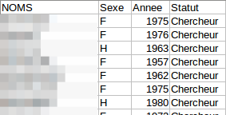
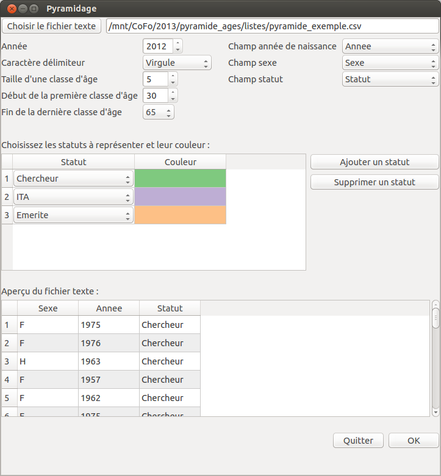
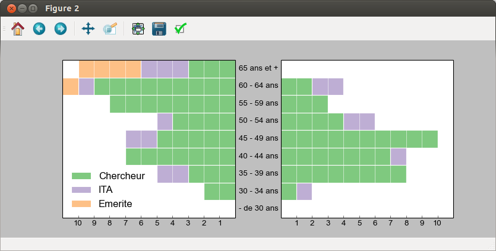

pyramidage
==========

Age pyramid in python, with matplotlib and Qt.

Choose a CSV file with one column for the birth year and one column for the sex, and optionally one column for the status :

It is possible to choose the size of the age class, the value of the first and last age classes and the CSV delimiter. You can also choose to use different colors for different status.

This small program will then create an age pyramid that you can export in image format (PNG, JPG...), or SVG.

