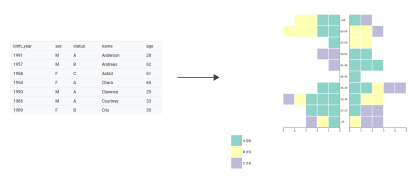

pyramidage
==========

Age pyramid in javascript, with D3.js.

More info here : [http://ouvrir.passages.cnrs.fr/pyramidage/pyramidage.html](http://ouvrir.passages.cnrs.fr/pyramidage/pyramidage.html)

